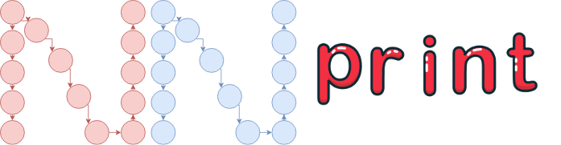
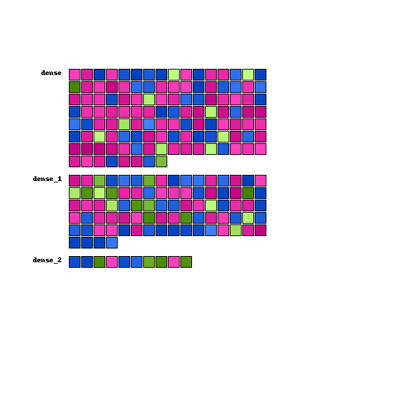

<p align="center">
  
</p>

<p align="center">
<a class="reference external" href="https://github.com/psf/black"></a>

<a href="https://www.python.org/downloads/">
        </a>
<a 

[](https://github.com/Propaler/nnprint/master/LICENSE)

>
</p>

# How to install

```sh
pip install .
```

# How to use it

### For now, just one main feature is avaiable. To check this out, you can just run:

```sh
cd nnprint
python nnvis.py
```

### The defaults models is instantiated at `nnprint/models`. To change wich you want to use, just change the line 329 at `nnvis.py` to `keras`

# Output

### The output of our only visualization will probably be like this:
<p align="center">
  
</p>

# Suport

### This library only suports `Torch` and `Keras` models. Check above wich layers we support from each framework:

## Torch
- Conv2d
- Linear

## Keras
- Dense

# Contribute

## Fork this repository and check our issues. A lot of `good first issues` will be probably avaiable